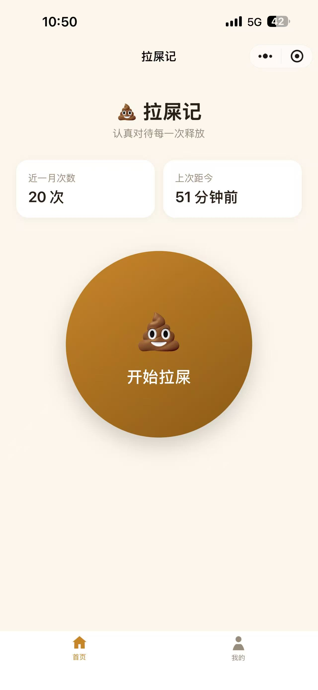
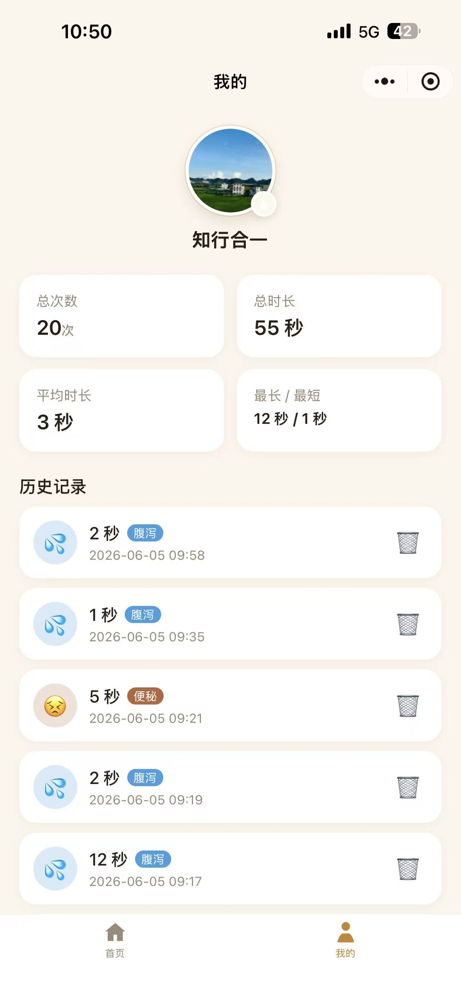

<h1 align="center">💩 拉屎记 · Poop Journal</h1>

<p align="center">认真对待每一次释放 —— 记录每次排便的时长与感受，云端多端同步。</p>

<p align="center">
  
  
  
  
  
</p>

---

## ✨ 功能特性

- ⏱️ **一键计时打卡** —— 开始 / 结束,自动记录每次时长
- 😌 **感受标记** —— 正常 / 喷射 / 便秘 / 腹泻 / 不尽,5 种状态;3 秒倒计时不选则自动记录
- ☁️ **云端同步** —— 微信云开发数据库,按 `openid` 隔离,换设备、重装数据不丢
- 🔁 **失败重试** —— 保存失败自动存本地,在「我的」页一键重新保存
- 📊 **统计概览** —— 近一月次数、上次距今、总次数 / 总时长 / 平均 / 最长最短
- 🗂️ **历史记录** —— 按时间倒序,支持删除
- 🙋 **个人资料** —— 微信头像 / 昵称,圆形头像 + 品牌徽章,可自定义

## 📸 界面预览

> 截图占位 —— 把你的截图放到 `docs/screenshots/` 下(命名 `home.png`、`me.png`)即可自动显示。

<p align="center">
  
  &nbsp;&nbsp;
  
</p>

## 🛠 技术栈

| 类别 | 选型 |
|------|------|
| 框架 | 微信原生小程序（WXML / WXSS / JS） |
| 后端 | 微信云开发（云数据库 + 云存储） |
| 用户识别 | 静默 `openid` + 「仅创建者可读写」权限,无登录页 |
| 测试 | Node 内置 `node:test`（纯函数单测） |

## 🚀 快速开始

> 云开发需要**已注册的小程序 AppID**（不支持测试号）。

1. **填 AppID** —— 把 `project.config.json` 的 `"appid": "YOUR_APPID_HERE"` 改成你的 AppID
2. **开通云开发并建集合** —— 微信开发者工具 → 云开发 → 开通,新建两个集合,**权限均设为「仅创建者可读写」**:
   - `poop_records`（排便记录）
   - `poop_profile`（用户资料）
3. **填云环境 ID** —— 把 `miniprogram/app.js` 的 `env: 'YOUR_CLOUD_ENV_ID'` 改成你的云环境 ID

然后用微信开发者工具打开本项目根目录即可编译运行。

```bash
# 克隆
git clone https://github.com/<your-username>/lashi-miniprogram.git
cd lashi-miniprogram

# 跑纯函数单测（无需微信环境）
npm test
```

## 🗂 项目结构

```
miniprogram/
├── app.{js,json,wxss}      全局配置 + 云初始化 + 样式变量
├── pages/
│   ├── index/              首页：计时打卡 + 感受面板
│   └── me/                 我的：统计卡 + 头像昵称 + 历史记录
├── images/                 tabBar 图标 + 头像/徽章素材
└── utils/
    ├── poop.js             数据常量 + 工具函数（有单测）
    └── store.js            云数据库 + 本地缓存 + 失败重试
```

## 🗃 数据模型

| 集合 | 字段 |
|------|------|
| `poop_records` | `_openid`(自动) · `startAt` · `endAt` · `duration`(秒) · `feeling` |
| `poop_profile` | `_openid`(自动) · `nickname` · `avatarFileID` |

用户识别依赖云数据库「仅创建者可读写」权限,按 `_openid` 自动隔离,无需登录页。

## 🧪 测试

```bash
npm test
```

纯函数（时间格式化、时长换算、相对时间等）由 `node:test` 覆盖,无需微信运行时。

## 📄 许可证

仅供学习与个人使用。如需开源协议,可自行添加 `LICENSE` 文件（如 MIT）。

---

<p align="center">设计与实现文档见 <code>docs/superpowers/</code> · Built with ❤️ &amp; Claude Code</p>
